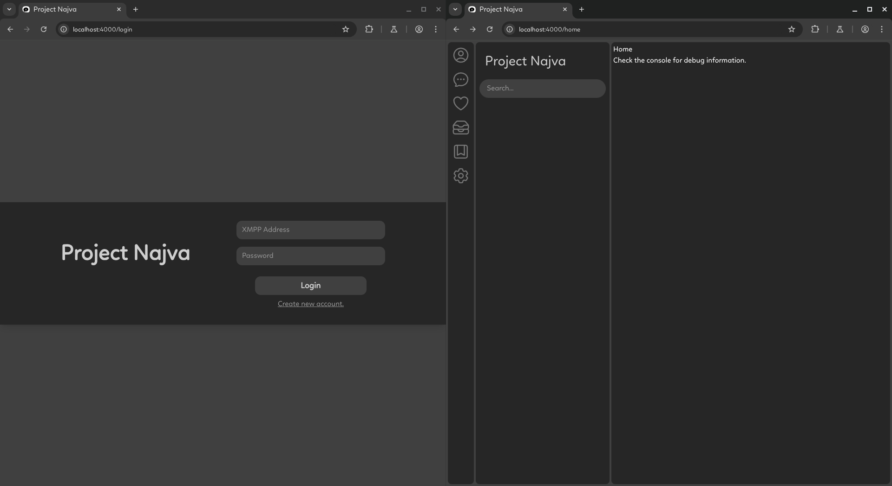
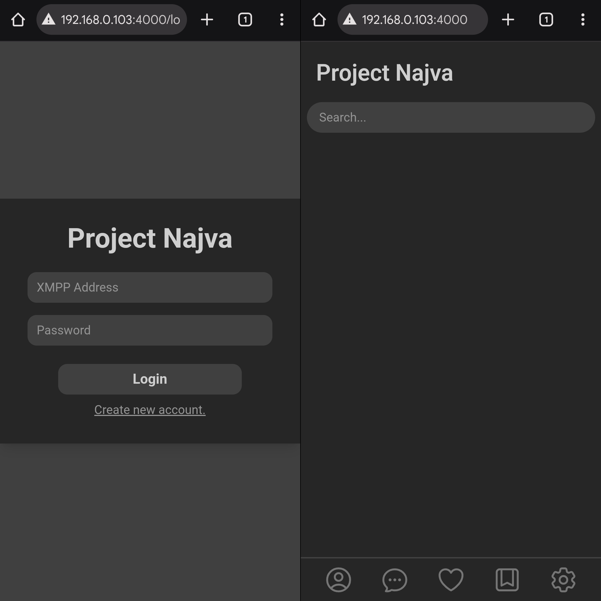
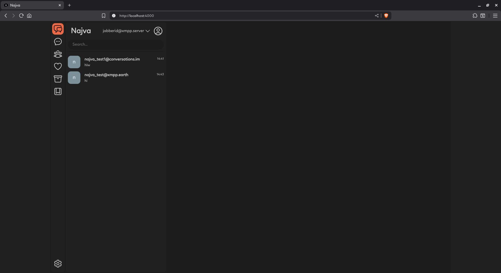

# Najva

**Najva** aims to become *the go-to web client for XMPP*, spreading the light of security and freedom by making XMPP more accessible — and actually usable in everyday life.


## Current State

## 🚧 *Still in early development / pre-alpha* 🚧

- Just made sure the UI appears perfect on mobile to desktop, and everything in between.

This is a [Phoenix LiveView](https://hexdocs.pm/phoenix_live_view/) project. The library used is [ProcessOne XMPP library](https://github.com/processone/xmpp) for Erlang/Elixir.

---


### **First Look:**

<!-- 
 -->


---

## Installation

### Prerequisites

- Elixir
- Erlang

Make sure both are installed and available in your system's PATH.

### Steps

1. Clone or download this repository.
2. Navigate to the project directory.
3. Run the following commands:

```bash
mix setup
mix phx.server
```

### ⚠️ Common Issues

You might run into a few errors related to missing OpenSSL or some C libraries, depending on your system setup.
Don’t panic — just copy the error and paste it into your AI assistant (like GitHub Copilot, ChatGPT, etc.).
With a few terminal commands, things should be up and running smoothly.

### ✅ Access

Once the server starts, visit:

http://localhost:4000